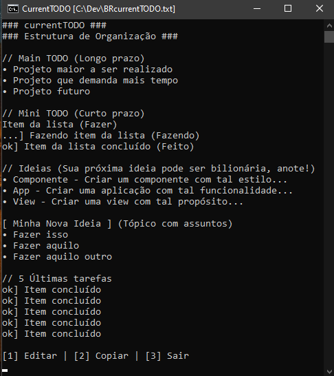
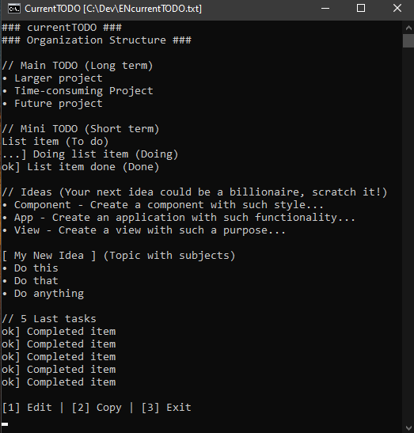

# CurrentTODO
🇧🇷 Exiba, copie e salve seus textos de forma prática!

🇺🇸 Display, copy and save your texts simply!

## Semântica
🇺🇸 Semantics

## Como usar
🇺🇸 How to Use

>🇧🇷 
1. Clone este repositório
2. Escolha o idioma do arquivo e apague o outro
3. Edite o arquivo .bat e aponte o caminho do arquivo que deseja mostrar (recomendo .txt)
4. Salve e execute o programa

>🇺🇸 
1. Clone this repository
2. Choose the file language and delete the other
3. Edit the .bat file and point to the path of the file you want to display (recommended .txt)
4. Save and run the program

## LICENSE

Copyright &copy; 2024 Roberto Nóbrega Jr. ([@devrenj](https://github.com/devrenj)) under MIT License